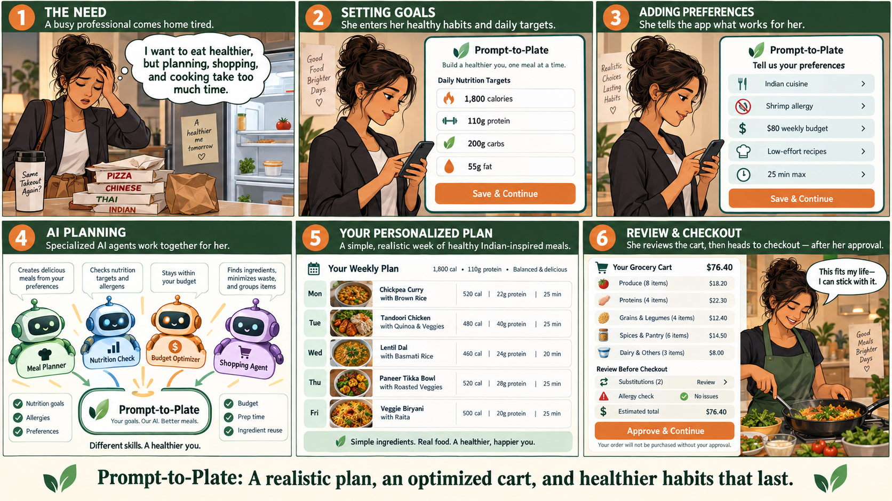

## Prompting and Interview Notes

### Notes from the prompting study

- We tested the same six meal-planning and grocery-cart scenarios with Claude, Microsoft 365 Copilot, and Gemini. The scenarios included normal requests, competing constraints, missing product information, allergy risks, budget pressure, and attempts to push the model toward checkout.
- Claude produced the strongest overall results, but it still described one plan as feasible even when two meals exceeded the stated cooking-time limit. That reminded me that a polished and mostly correct answer can still contain a meaningful contradiction.
- Copilot generally protected the user's control over checkout and disclosed budget problems, but several responses had incomplete carts, nutrition misses, or arithmetic errors. In one case, it gave an estimate without producing the requested seven-day plan and itemized cart.
- Gemini performed well when translating one approved plan into a cart, but its planning responses frequently invented products, omitted ingredients, or reported incorrect nutrition. It also invented a curry kit and unsupported product details in an allergy-sensitive scenario.
- Across the tools, allergy refusals and the no-checkout boundary were often handled better than routine calculations and multi-constraint tracking. I would not rely on the model's confidence as proof that a plan is complete or feasible.
- My main takeaway from the prompting study is that the model can help generate options and explain trade-offs, but nutrition totals, cart coverage, prices, package quantities, and time limits need independent validation.

### Notes from Speed Dating

#### Interview 1

- I interviewed a busy UIUC MSTM graduate student who often eats on campus and uses grocery delivery occasionally. Their main problem was decision fatigue rather than a lack of nutrition knowledge.
- They ranked time first, followed by reasonable health and affordability. They were not looking for a “perfect” nutrition plan.
- Honest cooking-time estimates were essential to their trust. They said that if a meal advertised as 20 minutes actually took an hour, they probably would not use the application again.
- If the system cannot satisfy every requirement, they want it to state exactly what is being compromised instead of quietly changing the plan.
- They preferred simple requests such as “make this easier” or “replace this meal” instead of manually editing individual ingredients.
- They were willing to let the application create the meal plan, but wanted to approve the grocery cart before anything was ordered.
- They would wait about 20–30 seconds for a complete weekly plan and grocery list. To lower cost, they preferred fewer ingredients and repeated meals.

#### Interview 2

- I also interviewed a UIUC undergraduate with limited cooking experience. They currently save recipes from TikTok and Instagram but rarely turn those ideas into actual meals.
- For this participant, “easy” meant inexpensive, quick, and made with only a few ingredients. A recipe with 15 ingredients did not feel easy even if its steps were simple.
- Cooking-time accuracy was again the most noticeable trust issue. They wanted unavailable items to be replaced only with a visible explanation.
- Their ideal editing interaction was simply saying, “I don't like this,” and receiving a replacement meal.
- They were comfortable with the system choosing meals and creating a grocery list, but not purchasing groceries without showing them the cart first.
- Their wait-time tolerance was lower (about 10–15 seconds) and they were also comfortable repeating meals if that reduced cost.

#### Cross-Interview Takeaway

- Looking across all eight interviews, every participant wanted the AI to draft the cart and every participant wanted checkout to remain a human decision. Most also preferred targeted edits, visible trade-offs, ingredient reuse, and honest uncertainty over silent substitutions or full-plan regeneration.

## Class-Generated Storyboard

The storyboard represents the intended progression from the user's planning burden to AI-supported meal and grocery planning, followed by a human review point before the workflow becomes consequential.

## One finding that changed (or confirmed) my assumption about the proposed scenario

The finding that most changed my assumption was how strongly both of my interview participants connected trust to everyday practicality, especially cooking time and the number of ingredients. I originally thought users would judge the system mainly by whether it met nutrition goals and produced a complete cart. The interviews showed me that a nutritionally correct plan can still fail if it does not match the user's available time, skill, and mental energy. At the same time, the prompting study showed that AI can sound confident while missing a time limit, ingredient, or calculation.

This connects to complementarity and shared mental models. The AI can search through options and perform repeatable work, but the user has context about what “easy,” “fast,” or “realistic” actually means in their life. The system should make its interpretation of those terms visible, show which constraints were met or compromised, and let the user revise one meal without restarting the entire plan. That creates a more accurate shared mental model between the person and the system. It also supports better trust calibration because the user is not being asked to trust a polished recommendation blindly; they can see the checks, exceptions, and decisions that still require their judgment.

## Reflection

This validation work made the project feel less like a meal generator and more like a coordination problem. The prompting results showed that generation alone is not enough, while the interviews showed that users do not want to become the system's manual quality-control layer. I think our strongest direction is to let AI draft the plan and cart, use deterministic checks for measurable requirements, and bring only meaningful exceptions and trade-offs to the user.

For the next checkpoint, I would pay particular attention to targeted meal replacement, honest cooking-time validation, visible progress during longer runs, and a clear summary of what changed after an edit. The cart should update with the meal plan, but checkout should remain outside the automated workflow. Those choices reflect what participants actually asked for and create a clearer division of responsibility between the user and the AI.
