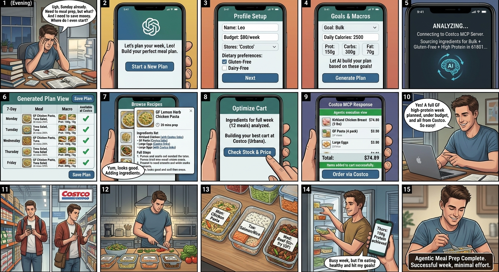

## Prompting and Interview Notes

### Notes from the prompting study

- I helped write the prompting protocol and collect the receipts, and I designed and built the interactive prototype and wrote the design specification that came out of this validation. We ran the same six meal-planning and grocery-cart scenarios through Claude, Microsoft 365 Copilot, and Gemini, using the synthetic Costco inventory and a user with no pantry.
- Claude was the most complete, but in Prompt 4 it listed two lentil lunches at 20–25 minutes against a hard 20-minute limit, asked the user to confirm, and then still described the plan as feasible and meeting all targets. A flagged conflict was treated as resolved without an answer.
- Copilot respected the no-checkout boundary, but Prompt 1 returned only a cost estimate with no plan or itemized cart, and in Prompt 2 the protein shakes in the meal plan were dropped from the cart "to control cost" without saying which meals lost them.
- Gemini invented prices and package sizes in Prompt 1, assumed pantry staples in Prompt 4 even though the user had none, claimed products were nut-free without the ingredient data to support it, and in Prompt 5 invented a curry kit with its own price and nutrition and put it in the cart.
- From the shopping-agent side, the pattern I noticed was that every model was comfortable *building* a cart, but none could reliably prove the cart matched the plan. Coverage, quantities, prices, and arithmetic all needed a check outside the model.

### Notes from Speed Dating

#### Interview 1 (ID 1 in the [interview index](../INTERVIEW_INDEX.md))

- I interviewed a UIUC MSIM student.
- Pantry awareness came up straight away: "If I already have rice and onions, I don't want the app telling me to buy more." For them, a duplicate purchase is a sign that the system doesn't understand their situation, and it makes them doubt the whole cost estimate.
- On editing, they wanted to see the full week first and then make targeted changes: "I'd want to see the whole plan and then say 'change Wednesday.' I wouldn't want to start over every time I don't like one meal."

#### Interview 2 (ID 2 in the [interview index](../INTERVIEW_INDEX.md))

- I also interviewed a UIUC MS Engineering student.
- Their main concern was the system overriding a decision they had already made: "If I say chicken for lunch, don't change it later just because you're optimizing the rest of the plan." Some choices should be locked, and optimization should happen around them.

#### Cross-Interview Takeaway

- Both participants were happy for the AI to do the planning work, but both wanted their own decisions (what they already have, what they chose to eat) to be treated as fixed inputs, not as things the system can optimize away. Both preferred changing one part of the plan over regenerating it.

## Class-Generated Storyboard

My storyboard follows Leo, a student who dreads Sunday meal prep. He sets a budget and a store, enters calorie and macro goals, and the AI builds a week of meals, sources the ingredients from Costco, and optimizes the cart. The agent then places the order, and Leo cooks, preps and hits his goals with minimal effort.

## One finding that changed (or confirmed) my assumption about the proposed scenario

My storyboard assumed the hard part was generation: once the AI produced a plan and a cart, the user would accept it, and the agent could go as far as ordering. Validation changed that in three ways.

First, the prompting study showed that a confident, well-formatted answer can still contain invented products, a dropped ingredient, or a total that doesn't add up, so the cart cannot be trusted just because the model produced it. Second, my interviews showed that users bring decisions the plan has to respect, such as what is already in the pantry and what they have chosen to eat, and that they want to change one meal rather than accept or reject the whole week. Third, the step in my storyboard where the agent orders is the step participants were least willing to hand over.

This changed the design from "AI plans and buys" to "AI drafts, software checks, the user decides." Pantry items are entered before planning and never bought. Single meals can be swapped without touching the rest of the week. Calories and protein are computed by code, not the model, and the cart is checked for coverage before it can be called ready. The workflow stops at a reviewed cart, and checkout stays with the user.

## Reflection

In Checkpoint 1, I read research on AI shopping agents (Allouah et al., 2025; Tou et al., 2025) that found agents carry their own product biases and struggle to verify several constraints at once. The prompting study showed the same thing in our domain: the models were good at drafting and weak at verifying. That is a useful division of labor rather than a reason to give up on the idea. In complementarity terms, the AI handles the search across meals and products, deterministic checks handle the arithmetic and coverage, and the person keeps the decisions that depend on their own context and carry consequences, such as their pantry, their locked choices, and the purchase itself.

Building the prototype made these boundaries concrete. Each validation finding had to become something on screen: an approval card before anything is shopped, a pantry field whose items are never bought, a Swap button that changes one meal and re-checks only that day, a **Why?** panel that shows the USDA entry behind a number, and a cart review that compares every item with the list. Designing those screens showed me that trust cues only work when they are specific. A single "verified" badge says less than a line-by-line comparison the user can check.

For the next checkpoint, I would focus on making those boundaries visible: show which items came from the pantry, mark locked choices so the system cannot change them silently, explain why each product was picked against the plan's needs, and keep the approval step before anything reaches the store.
